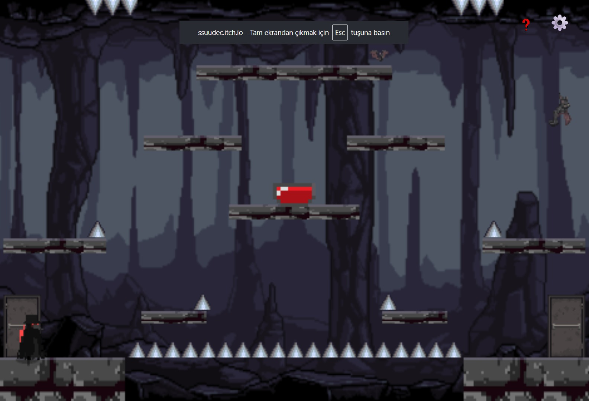
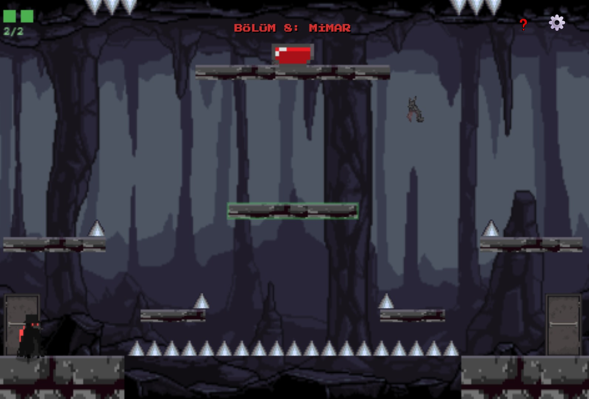

# Mağaradan Kaçış

**Web Tabanlı Oyun Geliştirme Projesi**

🎮 **[Oyunu Oyna](https://ssuudec.github.io/magaradan-kacis-game/)**

---

## Hakkında

[That Tiny Recursive Room](https://preetsr.itch.io/that-tiny-recursive-room) oyunundan esinlenilmiştir. Aynı oda, her bölümde farklı kurallarla tekrar eder.

## Amaç

**Kırmızı butona basıp çıkış kapısından geç** — ama her bölümde farklı bir zorluk var:

## Kontroller

- **Hareket:** WASD / Ok tuşları
- **Zıpla:** Space / W / ↑
- **Sıfırla:** R
- **Fare:** Bölüm 7, 8, 10'da sürükleme ve tıklama

## Ekran Görüntüleri

## Teknoloji

HTML5 Canvas + Vanilla JavaScript (kütüphane yok)

## AI Kullanımı

Tüm detaylar: [AI.md](AI.md)

## Asset Kaynakları

| Asset | Kaynak |
|---|---|
| Karakter sprite | [Gabry Pixel - Plague Crow](https://gabry-corti.itch.io/plague-crow) |
| Mağara arka plan | [Admurin - Parallax Backgrounds: Caves](https://admurin.itch.io/parallax-backgrounds-caves) |
| Kapı | [karsiori - Door Pack ](https://karsiori.itch.io/pixel-art-door-pack-animated) |
| Yarasa | [PixelSkeys - Bat Pixel Art Pack Free](https://opengameart.org/content/bat-sprite) |
| Sesler | [Freesound](https://pixabay.com/tr/)  |
| Diken | [Omniclause - Spikes](https://omniclause.itch.io/spikes)|
| Buton | Kendi çizimim |
| Hint | Gemini AI |

---

**Geliştirici:** [Sude Çakmak] 
**Hedef Oyun:** https://preetsr.itch.io/that-tiny-recursive-room
